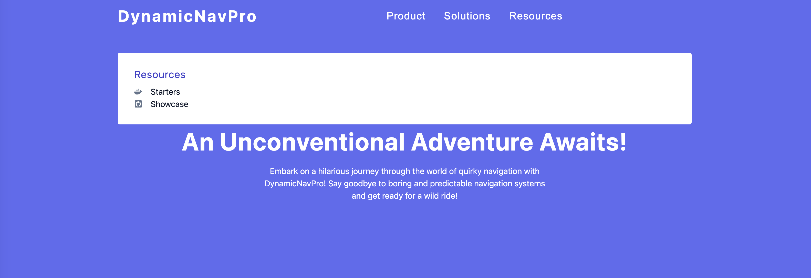

## DynamicNavPro App

This React project focuses on building a website with a navigation bar, hero section, sidebar, and showing specific content in a submenu. It involves creating components, managing global state using the `Context API`, and styling the user interface using CSS. Additionally, it utilizes mouse events like `onMouseEnter`, `onMouseOver`, and `onMouseLeave` to enhance user experience.

