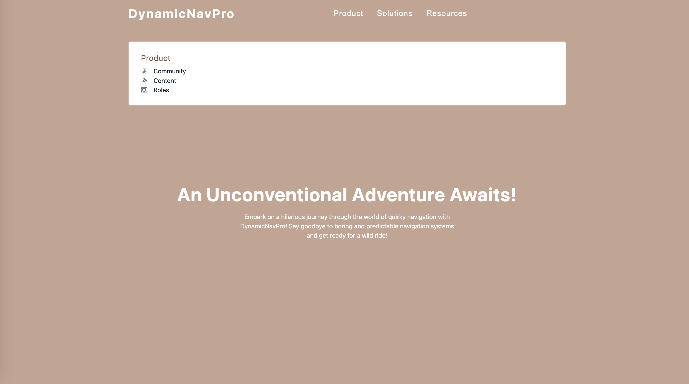

## DynamicNavPro

This React project focuses on building a website with a navigation bar, hero section, sidebar, and showing specific content in a submenu. It involves creating components, managing global state using the `Context API`, and styling the user interface using CSS. Additionally, it utilizes mouse events like `onMouseEnter`, `onMouseOver`, and `onMouseLeave` to enhance user experience.

## Tech Stack
- `JavaScript`: The foundational programming language for creating responsive and interactive features.
- `React`: The powerful JavaScript library used to build the project: 
- - `useState` The React hook used to manage state.
- - `createContext`: The React hook used for creating a context object to share data across components in the component tree.
- - `useContext`: The React hook used to access the value provided by a context and subscribe to its changes in functional components.
- `React Icons`: The popular library that provides a vast collection of icons for enhancing the user interface and user experience in the project.

### Explore The Website
[DynamicNavPro on Netlify](https://dynamic-nav-pro.netlify.app/)

### Preview

